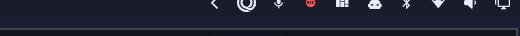
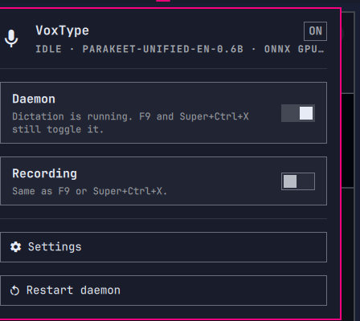

# VoxType Tray



The Omarchy port of [VoxType Tray](https://github.com/matt-shearing/voxtype-tray):
always-visible dictation control for [VoxType](https://voxtype.io) on the
[Omarchy](https://omarchy.org) bar.

<p align="center">
  
</p>

The chip shows idle, recording, transcribing, or stopped. Right-click toggles
recording. Left-click opens the panel: daemon on/off, recording, the VoxType
settings TUI, restart.

Omarchy already ships a hover-only Dictation indicator in the centre of the
bar. That indicator opens `voxtype configure`. This chip stays on the bar and
toggles recording without hovering.

It is not a model or GPU picker. For that, see
[Voxtype Mode](https://github.com/Chernicharo/omarchy-plugin-voxtype-mode).

## Install

```sh
omarchy plugin add https://github.com/matt-shearing/omarchy-voxtype-tray.git --enable
```

That clones the plugin and can place the chip on the right of the bar.

VoxType itself is installed separately: Omarchy menu → Install → AI → Dictation,
or `omarchy-voxtype-install`.

## Use

- **Click** the chip — open the panel
- **Right-click** — toggle recording
- **Middle-click** — open `voxtype configure`

F9 (push-to-talk) and Super+Ctrl+X (toggle) still reach the same daemon.

## How it works

The chip watches `$XDG_RUNTIME_DIR/voxtype/state` and `voxtype.service`.
Recording calls `voxtype record toggle`. Daemon start/stop/restart go through
`systemctl --user`. Settings launches `omarchy-voxtype-config`.

Nothing in `~/.config` is rewritten except the bar layout entry Omarchy adds
when you enable the plugin.

## Requirements

| Dependency | Why |
|---|---|
| [VoxType](https://voxtype.io) (`voxtype-bin`) | Dictation daemon |
| Omarchy Quattro | Quickshell bar host |
| `systemd --user` | Daemon control |

## Remove

```sh
omarchy plugin remove contra.voxtype-tray
```

That removes the chip. It does not uninstall VoxType or edit `~/.config/voxtype`.

## Development

```sh
omarchy plugin validate .
```

Edits under `~/.config/omarchy/plugins/contra.voxtype-tray/` reload in the running
shell. Force a rescan with `omarchy-shell shell rescanPlugins` if a change does
not appear.

## License

MIT. See [LICENSE](LICENSE).

Not affiliated with Omarchy, 37signals, or VoxType.
